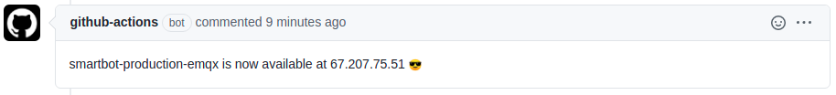

## About

GitHub Action to post the address of a load balancer.



This action will fetch the information about the given ingress and post the ip as a pull request comment. We
@smartsquarehq use this action after we've deployed the preview of a pull request so that the reviews can explore the
new features without messing around with the technical details.

___

* [Usage](#usage)
* [Keep up-to-date with GitHub Dependabot](#keep-up-to-date-with-github-dependabot)
* [Resources](#resources)

## :rocket: Usage

This action uses the default kubernetes configuration so make sure that you have setup the cluster.

```yaml
name: review-deployment

on: [ pull_request ]

jobs:
  build:
    runs-on: ubuntu-latest

    steps:
      - uses: actions/checkout@v2.3.4

      - name: Setup doctl
        uses: digitalocean/action-doctl@v2.1.0
        with:
          token: ${{ secrets.DIGITALOCEAN_ACCESS_TOKEN }}

      - name: Setup kubeconfig
        run: doctl kubernetes cluster kubeconfig save k8s-1-19-6-do-0-fra1-512312313
      
      - uses: smartsquaregmbh/post-k8s-lb@v0.1.0
        with:
          namespace: "my-namespace"
          loadbalancer: "my-loadbalancer"

```

## :bullettrain_front: Keep up-to-date with GitHub Dependabot

Since [Dependabot](https://docs.github.com/en/github/administering-a-repository/keeping-your-actions-up-to-date-with-github-dependabot)
has [native GitHub Actions support](https://docs.github.com/en/github/administering-a-repository/configuration-options-for-dependency-updates#package-ecosystem)
, to enable it on your GitHub repo all you need to do is add the `.github/dependabot.yml` file:

```yaml
version: 2
updates:
  # Maintain dependencies for GitHub Actions
  - package-ecosystem: "github-actions"
    directory: "/"
    schedule:
      interval: "daily"
```

## :books: Resources

* [werf](https://werf.io/)
* [actions](https://github.com/werf/actions)
* [documentation](https://werf.io/documentation/advanced/ci_cd/github_actions.html)
